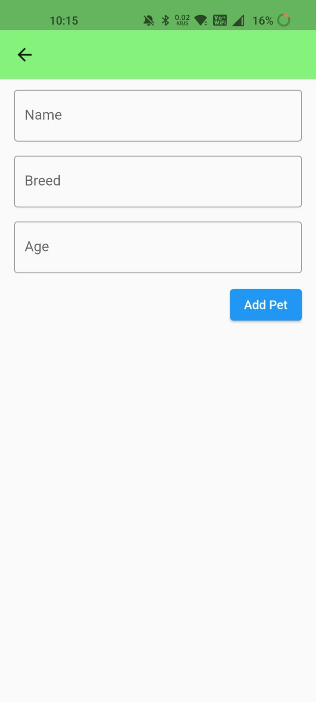
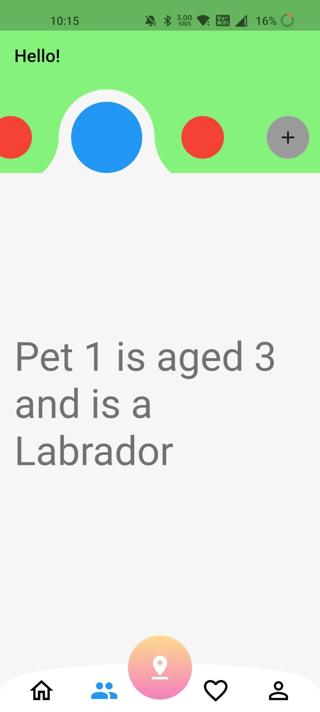
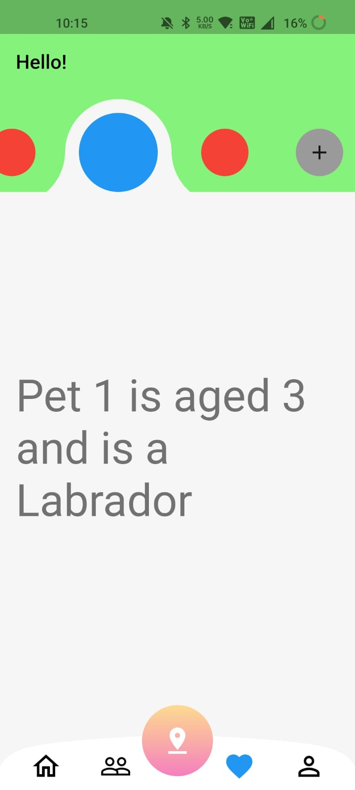
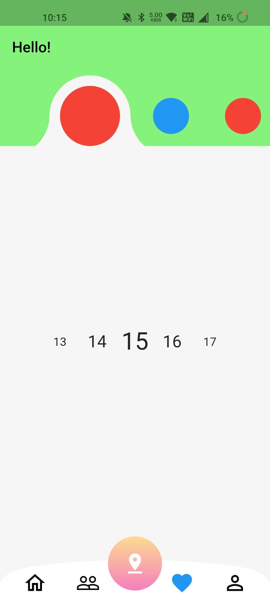

# toggleprojectscreen

# Toggle Screen
## _Toggle screen and Customize nav bar using Scroll Snap list_

[](https://nodesource.com/products/nsolid)

[](https://travis-ci.org/joemccann/dillinger)

Toggle Screen is a flutter mobile compatible application.


## Installation

Toggle Screen requires [Flutter](https://docs.flutter.dev/get-started/install) 3 to run.

Install the dependencies and devDependencies and start the server.

```sh
cd TOGGLESCREENPROJECT
flutter run
```


## Plugins

| Plugin | Link |
| ------ | ------ |
| Scroll_snap_list | [https://pub.dev/packages/scroll_snap_list] |


#### App Screen Shot






### APK Link

To Download Toggle Screen apk [APK LINK](https://drive.google.com/file/d/1CJJfKo5_zb7vLa-0OGPtF5NWfv7OhPn-/view?usp=sharing).

**Free App, Hell Yeah!**

